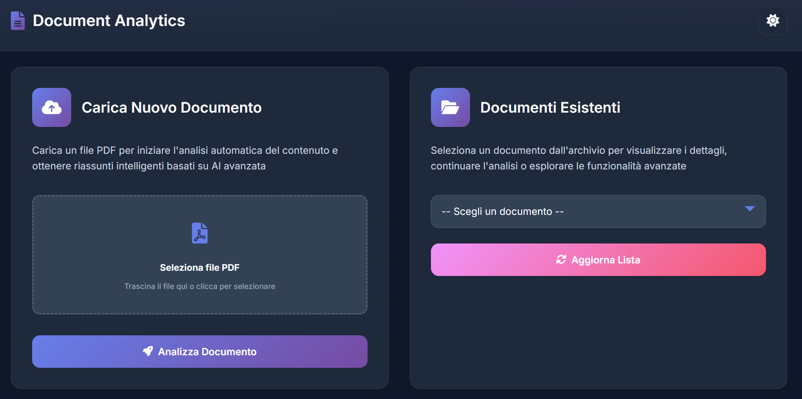
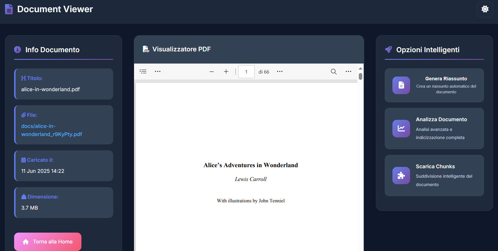
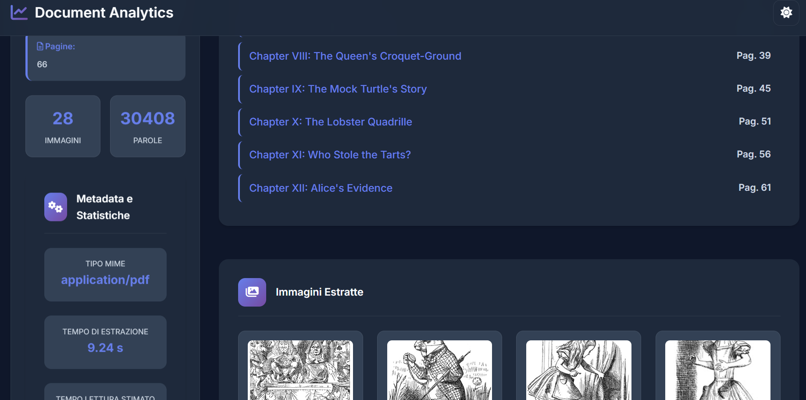

# RAG-based Document Analytics & Summarization

Progetto Django per il caricamento, l’analisi e il riassunto di documenti (PDF, articoli, report) tramite Retrieval-Augmented Generation (RAG).


## 🚀 Avvia in GitHub Codespaces

[](https://github.com/codespaces/new?hide_repo_select=true&repo=iorioluca97/django-rag-analytics&ref=dev)


---

## Caratteristiche principali

* Upload di documenti PDF tramite interfaccia web
* Estrazione testo dai documenti caricati
* Generazione di embeddings per ricerca semantica (integrazione con LangChain/MongoDB)
* Funzionalità di ricerca semantica nei documenti
* Estrazione di immagini ed insights
* Riassunti automatici personalizzabili e highlight di estratti chiave

---

## Requisiti

* Python 3.11+
* Django 5.2.2
* librerie per gestione PDF (es. `PyPDF2`, `pdfminer.six`)
* LangChain (per NLP)
* Client Pinecone o Chroma (per database vettoriale)
* Virtualenv o Poetry consigliati per l’ambiente virtuale

---

## Installazione

1. Clona il repository:

```bash
git clone https://github.com/tuo-utente/django-rag-analytics.git
cd django-rag-analytics
```

2. Crea e attiva un ambiente virtuale (consigliato):

```bash
pip install poetry
poetry install
```

3. Configura le variabili d’ambiente (`.env`):

```
OPENAI_API_KEY=la-tua-chiave-openai
MONGO_URI=uri-del-tuo-mongodb
```

4. Applica le migrazioni Django:

```bash
poetry run python rag_project/manage.py migrate
```

5. Crea un superuser:

```bash
poetry run python manage.py createsuperuser
```

6. Avvia il server di sviluppo:

```bash
poetry run python manage.py runserver
```

---

## Uso

* Visita `http://localhost:8000/` per accedere alla home page
* Carica documenti PDF tramite il form di upload



* Utilizza le funzionalità di ricerca e sintesi nei documenti caricati (da implementare)



* Utilizza l'analisi documentale per estrarre maggiori informazioni, immagini, table of content e molto altro!



---

## Struttura del progetto

```
rag_project/
├── documents/           # App principale
│   ├── migrations/
│   ├── templates/
│   │   └── documents/
│   │       ├── home.html
│   │       └── upload.html
│   ├── views.py
│   ├── models.py
│   └── urls.py
├── rag_project/         # Configurazione progetto Django
├── templates/           # Cartella template globale (se usata)
├── manage.py
└── requirements.txt
```

---

## Prossimi sviluppi

* Connessione a database vettoriale MongoDB per ricerca semantica
* Chat interattiva RAG based
* Funzioni di highlight interattivi
* Estrazione NER

---

## Contribuire

Se vuoi contribuire, apri una issue o una pull request.

---

## Licenza

[MIT License](LICENSE)
