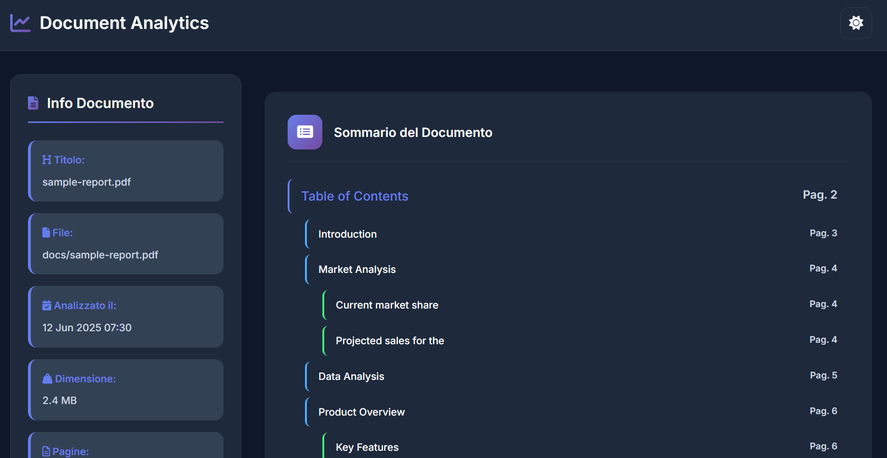
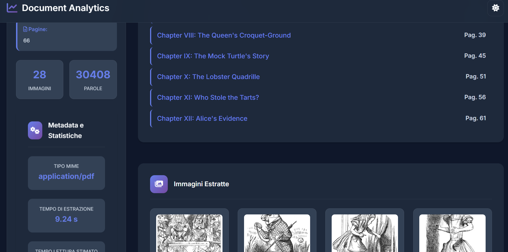

# 📄 RAG-based Document Analytics & Summarization
Non avevo nulla da fare nel weekend e django non l'ho mai visto quindi beccati questo.. 

*Progetto Django per il caricamento, l’analisi e il riassunto di documenti (PDF, articoli, report) tramite Retrieval-Augmented Generation (RAG).*

---

## 🚀 Avvia in GitHub Codespaces

[](https://github.com/codespaces/new?hide_repo_select=true&repo=iorioluca97/django-rag-analytics&ref=dev)

### ⚙️ Setup iniziale

1. Crea un file `.env` nella root del progetto e inserisci la tua API key OpenAI:

   ```env
   OPENAI_API_KEY="LA_TUA_API_KEY"
   
2. Avvia l'applicazione con Docker:

    ```env
    docker-compose up --build
    ```

## ✨ Caratteristiche principali
* Upload di documenti PDF tramite interfaccia web

* Estrazione del testo dai documenti caricati, generazione della table of content

* Generazione di embeddings per ricerca semantica (integrazione con LangChain)

* Estrazione di immagini e insight

* Riassunti automatici personalizzabili

## 🧪 Uso
* Carica i documenti PDF tramite il form di upload:


* Utilizza le funzionalità di ricerca e sintesi nei documenti caricati (da implementare)


* Utilizza l'analisi documentale per estrarre maggiori informazioni, immagini, table of content e molto altro!





---
🗂️ Struttura del progetto

```
rag_project/
├── documents/            # App principale
│   ├── migrations/
│   ├── templates/
│   │   └── documents/
│   │       ├── home.html
│   │       └── document.html
│   │       └── analytics.html
│   ├── views.py
│   ├── models.py
│   └── urls.py
├── rag_project/          # Configurazione principale Django
├── templates/            # Cartella template globale
├── manage.py
└── requirements.txt
```

## 🔭 Prossimi sviluppi
* Integrazione con database vettoriale (es. MongoDB + Atlas Vector Search)

* Chat interattiva basata su RAG

* Estrazione di entità nominate (NER)

* Altro? Suggerisci pure!!

## 🤝 Contribuire
Vuoi contribuire? Sentiti libero di aprire una issue o inviare una pull request.

## 📄 Licenza
Distribuito sotto [Licenza MIT](LICENSE)
